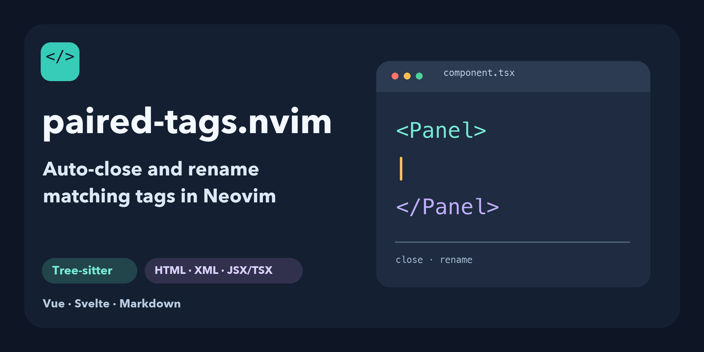

# paired-tags.nvim: auto-close and rename tags in Neovim

Automatically close markup tags and keep matching tag names in sync while
editing in Neovim. The plugin uses Tree-sitter for HTML, Django HTML templates,
XML, JSX/TSX, Vue, Svelte, and HTML embedded in Markdown. It also provides an
Enter mapping between adjacent HTML tags.



## Features

| Action | Result |
| --- | --- |
| Type `<section>` | Inserts `</section>` and keeps the cursor between the tags. |
| Rename either name in `<section>...</section>` | Updates its matching name, including when the opening tag has attributes or spans lines. |
| Press Enter at `<section>\|</section>` in HTML | Opens an indented content line and keeps the closing tag at the opener's indent. |

The plugin supports `html`, `htmldjango`, `xml`, `javascriptreact`,
`typescriptreact`, `vue`, `svelte`, and HTML embedded in `markdown`. It uses the
current buffer's Tree-sitter parser to identify tags; it does not install
parsers. The Enter feature works in `html` and `htmldjango` only.

### Automatic tag closing

- Creates a closer after a completed opening tag, including nested tags,
  custom HTML elements, JSX/TSX components, member and namespaced component
  names, and JSX fragments (`<>...</>`).
- Preserves an existing closer. It does not generate one for self-closing tags
  or HTML void elements such as `<br>` and ``. JSX/TSX PascalCase
  components such as `<Input>` remain paired rather than being treated as
  lowercase HTML void elements.
- Handles `>` inside quoted attributes, JSX expressions and generic component
  type arguments without treating it as the end of an opening tag.
- Avoids inserting tags in comparisons, strings, comments, Markdown code, and
  other non-markup text. It leaves an ambiguous parser state unchanged instead
  of consuming a parent's or sibling's existing closer.

### Rename matching tags

- Keeps the matching opener and closer in sync when either name is edited,
  including normal-mode edits, Insert edits, and paste.
- Changes only tag names. Attributes, nested content, neighboring elements,
  and unrelated closing tags stay in place. This covers incomplete edits,
  same-name descendants, temporarily invalid markup, HTML optional end tags,
  raw-text elements, and multiline attributes.
- Preserves JSX component spelling and XML case and UTF-8 names.

### Enter between HTML tags

With the cursor between adjacent matching tags, one `<CR>` creates a content
line and puts the closer at the opening tag's indentation. The content line
uses the buffer's effective `shiftwidth`, `expandtab`, and `tabstop`, so a
project's EditorConfig settings can govern it. A mismatched pair, completion
popup, special buffer, or other filetype keeps normal Enter behavior.

## Requirements

- Neovim 0.12.5 is the tested version. Older versions have not been verified.
- A working Tree-sitter parser for each language where tag closing or renaming
  is needed: `html`, `htmldjango`, `xml`, `javascript` for
  `javascriptreact`, `tsx` for `typescriptreact`, `vue`, `svelte`, and
  `markdown` and `html` for HTML embedded in Markdown. Parser installation is
  managed by your Neovim
  configuration; `nvim-treesitter` may be used for that purpose but is not a
  runtime dependency of this plugin.

When the parser is unavailable, tag closing and renaming leave the buffer
alone. The HTML Enter mapping does not require a parser.

## Installation

With [lazy.nvim](https://github.com/folke/lazy.nvim):

```lua
{
  "hardcodd/paired-tags.nvim",
  main = "paired_tags",
  opts = {},
  lazy = false,
}
```

With another plugin manager, add the repository to Neovim's runtime path and
call:

```lua
require("paired_tags").setup()
```

`setup()` installs Insert-mode `>` and `<CR>` mappings, text-change and cursor
callbacks, and a paste wrapper used to distinguish streamed paste from typing.
Calling it again in the same session is harmless. If another plugin also maps
`<CR>`, configure that plugin not to replace this mapping; for example,
`nvim-autopairs` can use `map_cr = false`. This plugin has no user options yet.

## Limits and roadmap

PHP templates are not supported in this release. Visual highlighting of the
current matching tag pair is also not implemented. Both are explicit roadmap
items in [ROADMAP.md](ROADMAP.md).

The plugin intentionally skips edits when the parser is absent or a pair
cannot be identified safely. It does not auto-install parsers, format a whole
document, or add punctuation pairing for quotes and brackets.

## Verification

The repository includes standalone tests for setup, HTML Enter, paired
editing, 56 language scenarios, and four bug-regression suites (51, 35, 62,
and 188 cases). Run from the repository root with an installed set of the
parsers listed above. `tests/bootstrap.lua` uses the parsers in Neovim's
standard data directory; set `PAIRED_TAGS_PARSER_RTP` to another parser
runtime path if necessary.

```sh
nvim --headless -u NONE -i NONE -n \
  '+luafile tests/bootstrap.lua' \
  '+lua local ok, err = pcall(dofile, "tests/setup_spec.lua"); if not ok then print(err); vim.cmd("cquit") end' \
  +qa!

nvim --headless -u NONE -i NONE -n \
  '+luafile tests/bootstrap.lua' \
  '+luafile tests/tag_bug_report_4_spec.lua'
```

Replace the test path with `html_enter_spec.lua`,
`paired_editing_spec.lua`, `rename_fast_path_spec.lua`,
`tag_scenarios_spec.lua`, `tag_bug_regressions_spec.lua`,
`tag_bug_report_2_spec.lua`, or
`tag_bug_report_3_spec.lua` to run the other suites. Synchronous tests need
the `pcall`/`cquit` wrapper shown above; regression runners exit on their own.
The contract and acceptance criteria are in [SPECS.md](SPECS.md).

## License

[MIT](LICENSE).
